# Лабораторна робота 1 з дисципліни “Розробка мобільних додатків”

## Студент: Хомнюк Віктор (ІПЗ-22-1)

## Опис проєкту
Ця лабораторна робота демонструє створення найпростішого мобільного додатку за допомогою **React Native та Expo**.  
Додаток включає три основні екрани:  

- **Головна (Новини)** – відображення списку новин  
- **Фотогалерея** – перегляд фотографій  
- **Реєстрація (Профіль)** – форма реєстрації користувача з перевіркою email, пароля та підтвердження пароля  

Додаток має кастомний хедер з логотипом ліворуч та назвою екрана справа, а також Footer з інформацією про студента під навігацією.

---

## Скріншоти

- Головна сторінка  
  

- Фотогалерея  
  

- Реєстрація  
  

- Інформація про новини 
  


## Інструкція із запуску

### Попередні кроки
1. Встановити **Node.js** та **npm** (версії сумісні з Expo)  
2. Встановити **Expo CLI** (якщо потрібно):  
   ```bash
   npm install -g expo-cli
   ```
3. Клонувати репозиторій:
   ```bash
   git clone https://github.com/ViktorKhomniuk/MobileLabsRN2026.git
   ``` 
5. Перейти до папки лабораторної роботи:
   ```bash
   cd MobileLabsRN2026/lab1
   ```
6. Встановити залежності:
   ```bash
   npm install
   ```
7. Запустити додаток:
   ```bash
   npx expo start
   ```

# Лабораторна робота №2: Архітектура навігації та високопродуктивні списки в React Native

## Огляд проєкту
Ця робота присвячена побудові сучасного мобільного інтерфейсу з використанням вкладеної навігації та складних компонентів відображення даних.

## Реалізований функціонал

### 1. Робота з даними та оптимізації
* **Інтерактивна стрічка новин:**
    * **Динаміка:** Реалізовано механізм `Pull-to-Refresh` для оновлення контенту та `Infinite Scroll` для пагінації даних.
    * **Продуктивність:** Оптимізовано рендеринг через параметри `windowSize`, `initialNumToRender` та `maxToRenderPerBatch`.
    * **UI:** Використано кастомні футери з індикаторами завантаження та делікатні розділювачі.
* **Алфавітний покажчик:**
    * Групування контактів за заголовками секцій.
    * Використання `stickySectionHeadersEnabled` для зручної навігації за списком.

### 2. Навігаційна система
* **Гібридна архітектура:** Поєднання **Drawer Navigator** та **Native Stack Navigator**.
* **Custom Drawer UI:** Повністю перероблений блок профілю автора з використанням темної палітри, аватарів із підсвіткою та бейджів.
* **Контекстні заголовки:** Реалізовано динамічну передачу назви новини в хедер екрана деталей.
* **Імерсивний дизайн:** Прозорі хедери на екрані деталей із кастомними кнопками повернення для кращого візуального досвіду.

## Інструкція із запуску

1. Клонуйте репозиторій:
   ```bash
   git clone 
2. **Перейдіть до папки проєкту**
   ```bash
   cd MobileLabsRN2026/lab2 
3. **Встановіть необхідні залежності:**
   ```bash
   npm install
4. **Запустіть Expo CLI:**
   ```bash
   npx expo start
5. **Відкрийте додаток:**
   * Скануйте QR-код через додаток Expo Go на вашому смартфоні.
   * Або натисніть **a** для запуску на Android Emulator.
   * Або натисніть **i** для запуску на iOS Simulator.

### Скріншоти застосунку
| Стрічнка новин | Деталі новин | Контакти | Кастомне меню |
| :---: | :---: | :---: | :---: |
|  |  |  |  |

### Чим відрізняється FlatList від ScrollView?
ScrollView - це базовий контейнер, який монтує всі дочірні елементи одночасно. Це створює критичне навантаження на пам'ять при великих списках. FlatList працює за принципом "лінивого рендерингу": він створює компоненти лише для тих даних, які входять у зону видимості, видаляючи з пам'яті ті, що знаходяться далеко за межами екрана.

### Що таке віртуалізація списків?
Віртуалізація - це процес заміщення реальних елементів списку, що знаходяться поза екраном, порожнім простором рівноцінного розміру. Це дозволяє зберігати позицію скролу та обробляти тисячі об'єктів, витрачаючи ресурси процесора лише на рендеринг 5-10 активних рядків.

### Як здійснюється передача параметрів між екранами?
Передача здійснюється через об'єкт параметрів у методі navigation.navigate('Target', { data: value }). На стороні отримувача дані видобуваються за допомогою пропса route.params або хука useRoute(). Це дозволяє створювати універсальні екрани.

### Що таке вкладена навігація?
Це ієрархічна структура, де один навігатор виступає в ролі екрана для іншого. У нашому випадку Drawer є кореневим навігатором, а Stack — вкладеним всередині одного з екранів. Це дозволяє поєднувати глобальне меню з можливістю глибокої навігації всередині конкретного розділу, зберігаючи незалежну історію переходів.

### У яких випадках застосовується SectionList?
SectionList є оптимальним вибором, коли дані мають логічну ієрархію або потребують групування. Він надає спеціалізований API для рендерингу заголовків секцій, які можуть ставати липкими, що значно покращує досвід користувача при роботі з розкладами, телефонними книгами або категоріями товарів.


# Лабораторна робота 3 з дисципліни “Розробка мобільних додатків”

## Студент: Хомнюк Віктор (ІПЗ-22-1)

## Опис проєкту
Ця лабораторна робота демонструє створення найпростішого мобільного додатку за допомогою **React Native та Expo**.  
Додаток включає два основні екрани:  

- **Головна (Новини)** – відображення самої гри  
- **Список завдань** – переглянути список всіх завдань в грі 

---

## Скріншоти

- Головна сторінка  
  

- Список завдань  
  


## Інструкція із запуску

### Попередні кроки
1. Встановити **Node.js** та **npm** (версії сумісні з Expo)  
2. Встановити **Expo CLI** (якщо потрібно):  
   ```bash
   npm install -g expo-cli
   ```
3. Клонувати репозиторій:
   ```bash
   git clone https://github.com/ViktorKhomniuk/MobileLabsRN2026.git
   ``` 
5. Перейти до папки лабораторної роботи:
   ```bash
   cd MobileLabsRN2026/lab1
   ```
6. Встановити залежності:
   ```bash
   npm install
   ```
7. Запустити додаток:
   ```bash
   npx expo start
   ```


   # Лабораторна робота №4: Робота з файловою системою в React Native з використанням бібліотеки expo-file-system

## Мета
Опанувати механізми роботи з локальною файловою системою мобільного пристрою, використовуючи можливості бібліотеки expo- file-system. Закріпити навички реалізації базових операцій над файлами й папками, організації файлової навігації та аналізу стану файлової системи.

## Опис реалізованого функціоналу

## Основні можливості

### 1. Навігація та перегляд файлів

- **Головний екран**  
  Відображає статистику сховища та вміст початкової папки.

- **Файловий менеджер**  
  Відображення вмісту поточної директорії у вигляді списку. Кожен елемент має:
  - Назву та іконки
  - Кнопку видалення 
  - Кнопку виведення інформації

**Навігаційні дії:**
- Перехід у підпапку – натискання на папку
- Відкриття текстового файлу в редакторі – натискання на файл
- Повернення назад – кнопка Назад у верхній панелі

### 2. Робота з файлами та папками

| Операція | Реалізація |
|----------|-------------|
| Створення папки | Кнопка «📁 Нова папка» → введення назви → створення порожньої директорії |
| Створення текстового файлу | Кнопка «📄 Новий файл» → введення назви та початкового вмісту |
| Видалення | Натискання на 🗑️ → діалог підтвердження → видалення |
| Редагування | Відкриття файлу → зміна тексту → збереження змін |

### 3. Редактор файлів (`FileEditorScreen`)

- Відкривається при натисканні на `.txt` файл
- Велике багаторядкове поле введення
- Кнопка **«Зберегти»** – оновлює файл на диску та повертає до файлового менеджера

### 4. Детальна інформація про файл/папку

Відображається через кнопку ℹ️. Містить:

| Поле | Опис |
|------|------|
| Назва | Ім'я файлу/папки |
| Тип | Для файлів – визначається за розширенням. |
| Розмір | Тільки для файлів, у форматі B/KB/MB/GB |
| Дата модифікації | Локальний формат дати та часу |

---

## Інструкція із запуску

1. Клонуйте репозиторій:
   ```bash
   git clone 
2. **Перейдіть до папки проєкту**
   ```bash
   cd MobileLabsRN2026/lab4
3. **Встановіть необхідні залежності:**
   ```bash
   npm install
4. **Запустіть Expo CLI:**
   ```bash
   npx expo start
5. **Відкрийте додаток:**
   * Скануйте QR-код через додаток Expo Go на вашому смартфоні.
   * Або натисніть **a** для запуску на Android Emulator.
   * Або натисніть **i** для запуску на iOS Simulator.

### Скріншоти застосунку
| Головна сторінка | Створення папки | Нова папка | Створення нового файлу | Зміна файлу | Інформація про файл | Видалення файлу |
| :---: | :---: | :---: | :---: | :---: | :---: | :---: |
| 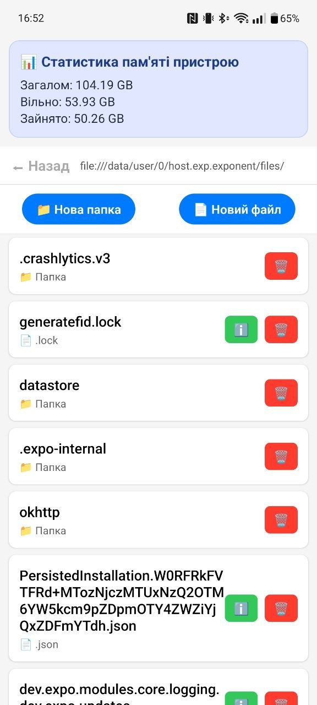 | 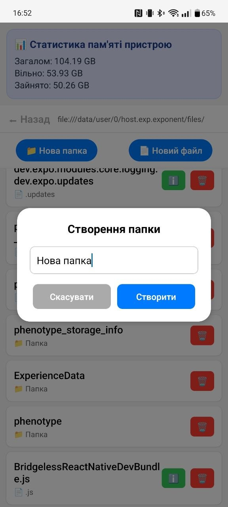 | 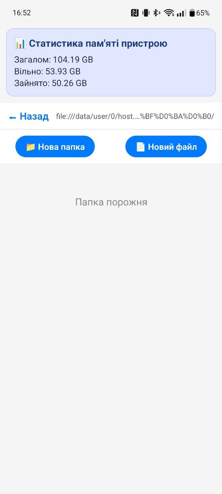 | 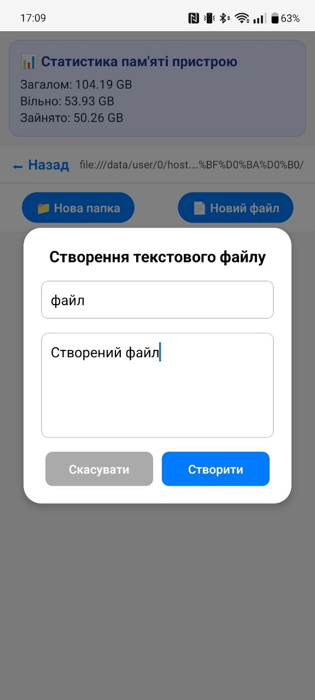 | 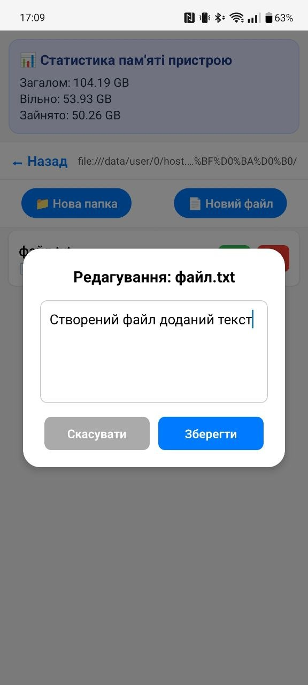 | 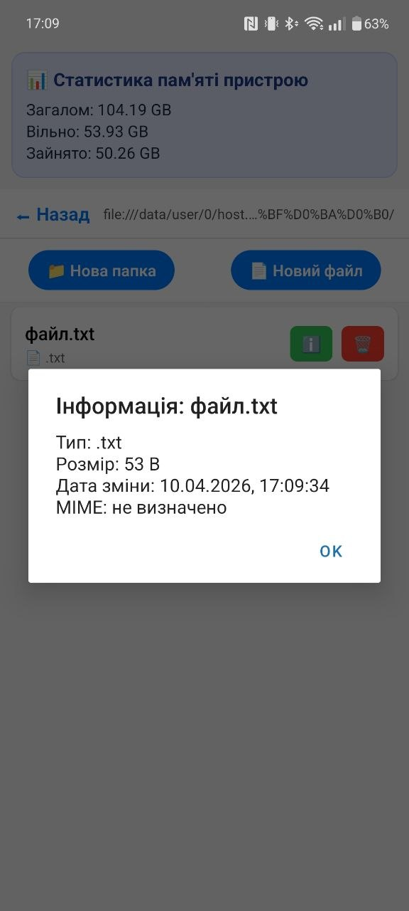 | 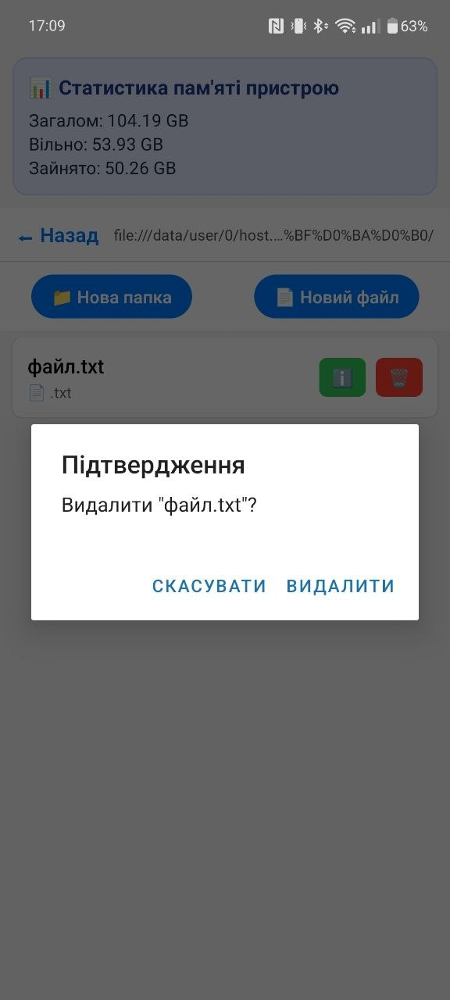 |


# Лабораторна робота 5 з дисципліни “Розробка мобільних додатків”

## Студент: Хомнюк Віктор (ІПЗ-22-1)

## Опис проєкту
Ця лабораторна робота демонструє створення найпростішого мобільного додатку за допомогою **React Native та Expo**.  
Додаток включає два основні екрани:  

- **Авторизація** – Авторизація користувача  
- **Реєстрація** – Створю аккаунт якщо немає 
- **Каталог** – Каталог всього товару
- **Детальий опис** – Детальний опис всього товару


---

## Скріншоти

- Головна сторінка  
   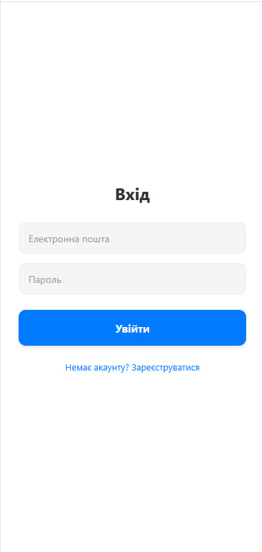

- Список завдань  
   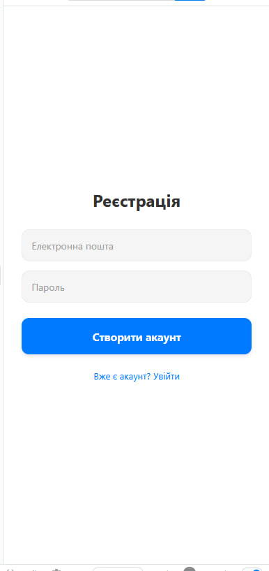

- Каталог 
   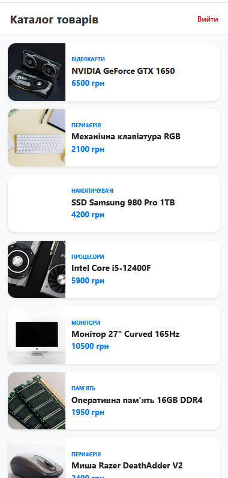
  
- Детальний опис 
   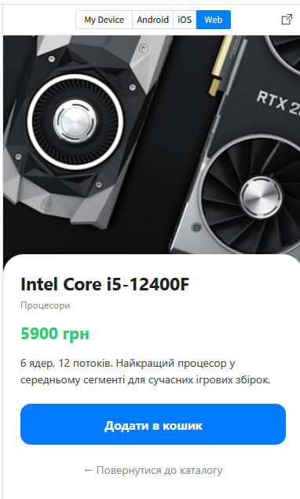


## Інструкція із запуску

### Попередні кроки
1. Встановити **Node.js** та **npm** (версії сумісні з Expo)  
2. Встановити **Expo CLI** (якщо потрібно):  
   ```bash
   npm install -g expo-cli
   ```
3. Клонувати репозиторій:
   ```bash
   git clone https://github.com/ViktorKhomniuk/MobileLabsRN2026.git
   ``` 
5. Перейти до папки лабораторної роботи:
   ```bash
   cd MobileLabsRN2026/lab1
   ```
6. Встановити залежності:
   ```bash
   npm install
   ```
7. Запустити додаток:
   ```bash
   npx expo start
   ```