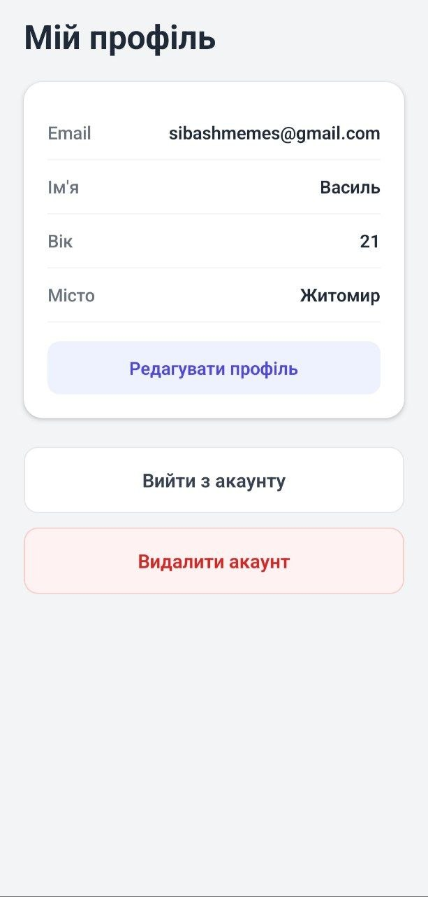
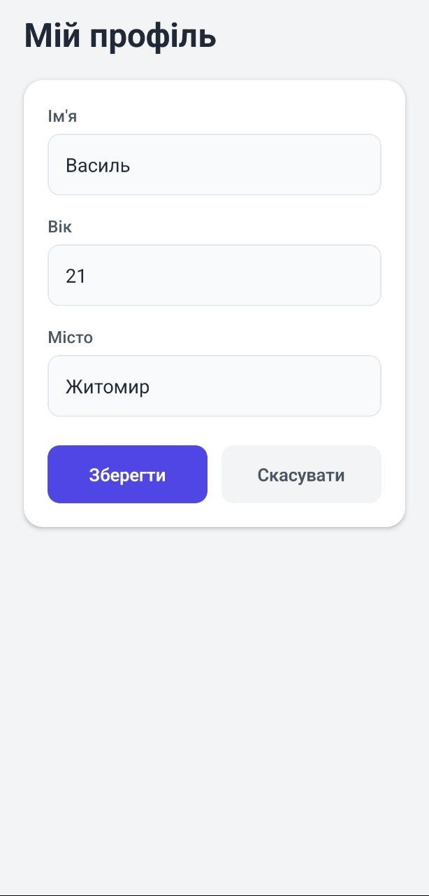
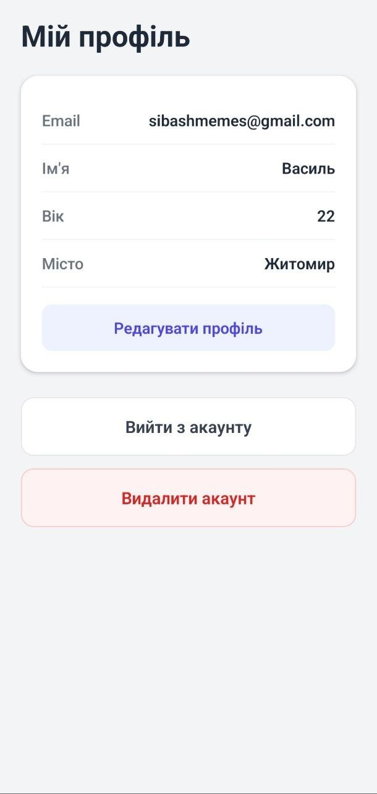
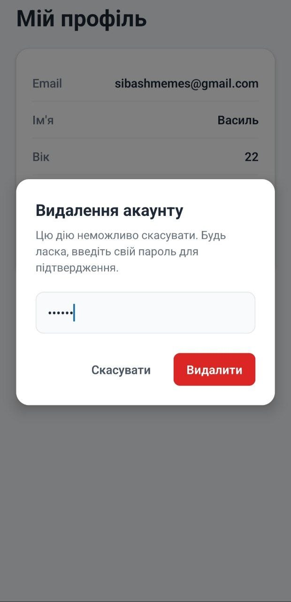
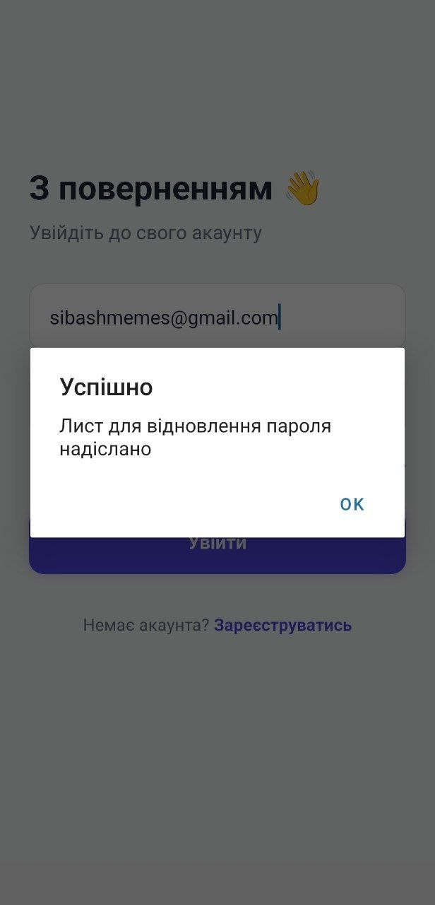
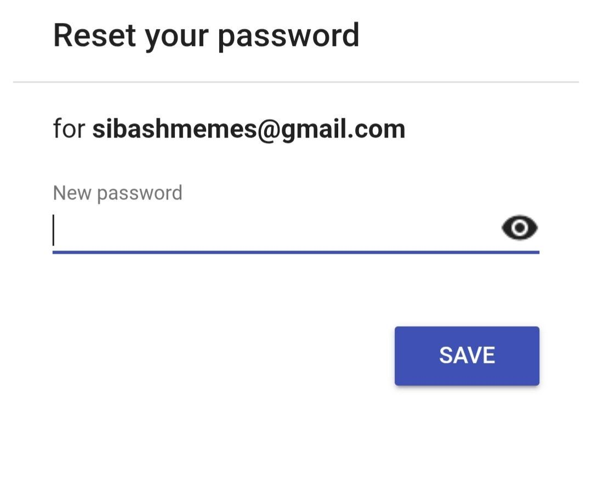

# React Native + Firebase Auth App

Сучасний мобільний застосунок, створений за допомогою **React Native** та **Expo**, з використанням **Expo Router** для навігації та **Firebase** (Authentication + Firestore) для керування користувачами та їхніми даними.

---

## Опис реалізованого функціоналу

Застосунок містить повноцінну систему аутентифікації та управління профілем користувача:

### Аутентифікація 

* Реєстрація нових користувачів з електронною поштою та паролем
* Вхід у систему (Login)
* Відновлення забутого пароля (Password Reset)
* Безпечний вихід із системи (Logout)
* Повне видалення акаунту (з вимогою повторного введення пароля для безпеки)

### Управління профілем 

* Збереження додаткових даних користувача при реєстрації (Ім'я, Вік, Місто)
* Перегляд даних профілю
* Редагування даних профілю в реальному часі

### UI / UX

* Сучасний, чистий та адаптивний дизайн екранів
* Використання `KeyboardAvoidingView` для зручного введення тексту
* Модальні вікна для підтвердження критичних дій (видалення акаунту)
* Індикатори завантаження під час виконання асинхронних запитів

### Архітектура

* Файлова маршрутизація за допомогою **Expo Router** з автоматичним перенаправленням залежно від стану авторизації (Auth Guards)
* Глобальне управління станом за допомогою **React Context API** (`AuthContext`)

---

## Інструкція запуску

### 1. Передумови

* Встановлений [Node.js](https://nodejs.org/)
* Встановлений [Expo CLI](https://docs.expo.dev/get-started/installation/)
* Застосунок [Expo Go](https://expo.dev/client) на мобільному пристрої (iOS/Android) або налаштований емулятор

---

### 2. Встановлення залежностей

Склонуй репозиторій та встанови всі необхідні пакети:

```bash
git clone 
cd lab6
npm install
# або
yarn install
```

---

### 3. Налаштування Firebase 

Створити файл `.env` у кореневій папці проєкту та додай свої ключі конфігурації Firebase:

```env
EXPO_PUBLIC_API_KEY=твій_api_key
EXPO_PUBLIC_AUTH_DOMAIN=твій_auth_domain
EXPO_PUBLIC_PROJECT_ID=твій_project_id
EXPO_PUBLIC_STORAGE_BUCKET=твій_storage_bucket
EXPO_PUBLIC_MESSAGING_SENDER_ID=твій_messaging_sender_id
EXPO_PUBLIC_APP_ID=твій_app_id
```

---

### 4. Запуск проєкту

Запустити локальний сервер розробки:

```bash
npx expo start
```

Після запуску відсканувати QR-код:

* Android — через **Expo Go**
* iOS — через стандартну камеру

---

## Скріншоти роботи застосунку


| Login                             | Register                             | Profile                             | Profile edit                         |
| Edited profile                    | Delete Modal                         | Delete Modal                             | E-mail                       |
| --------------------------------- | ------------------------------------ | ----------------------------------- | ---------------------------------- |
| --------------------------------- | ------------------------------------ | ----------------------------------- | ---------------------------------- |
|  |  |  |  |  |  |  |  |

---

## Висновки

В рамках цього проєкту було реалізовано повноцінний мобільний застосунок з авторизацією та роботою з базою даних.

### Основні досягнення:

* Інтеграція з **Firebase Auth** та **Firestore** через `.env`
* Побудована надійна система маршрутизації (**Expo Router + Auth Guards**)
* Вирішено проблему race conditions через `onAuthStateChanged`
* Реалізовано сучасний, зручний UI з обробкою помилок та loading-станами

