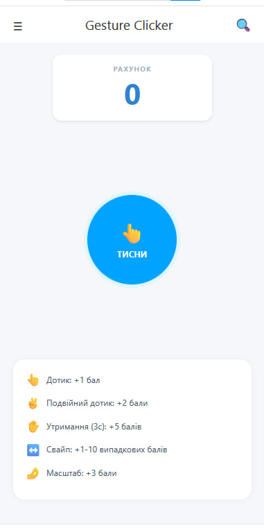
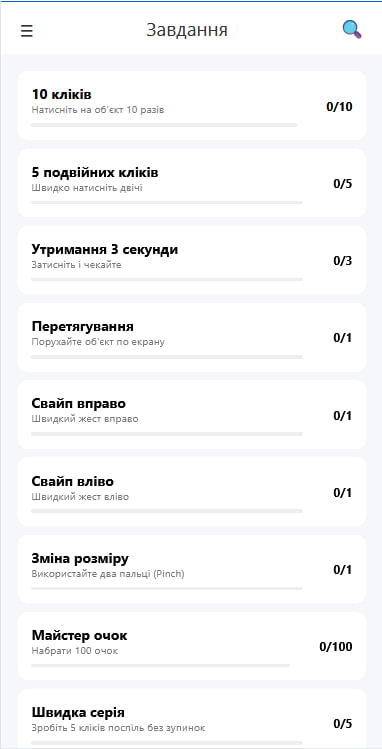

# Лабораторна робота 3 з дисципліни “Розробка мобільних додатків”

## Студент: Хомнюк Віктор (ІПЗ-22-1)

## Опис проєкту
Ця лабораторна робота демонструє створення найпростішого мобільного додатку за допомогою **React Native та Expo**.  
Додаток включає два основні екрани:  

- **Головна (Новини)** – відображення самої гри  
- **Список завдань** – переглянути список всіх завдань в грі 

---

## Скріншоти

- Головна сторінка  
  

- Список завдань  
  


## Інструкція із запуску

### Попередні кроки
1. Встановити **Node.js** та **npm** (версії сумісні з Expo)  
2. Встановити **Expo CLI** (якщо потрібно):  
   ```bash
   npm install -g expo-cli
   ```
3. Клонувати репозиторій:
   ```bash
   git clone https://github.com/ViktorKhomniuk/MobileLabsRN2026.git
   ``` 
5. Перейти до папки лабораторної роботи:
   ```bash
   cd MobileLabsRN2026/lab1
   ```
6. Встановити залежності:
   ```bash
   npm install
   ```
7. Запустити додаток:
   ```bash
   npx expo start
   ```