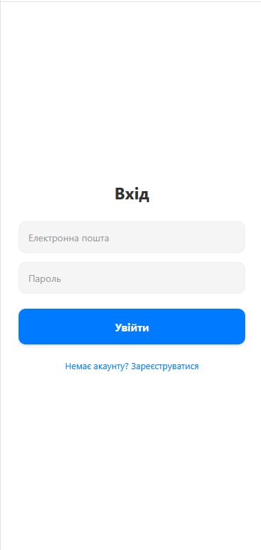
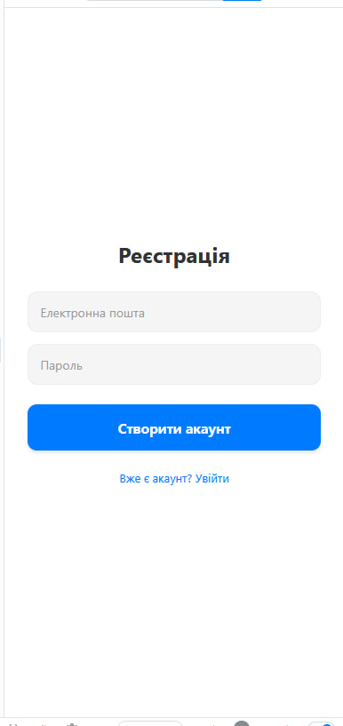
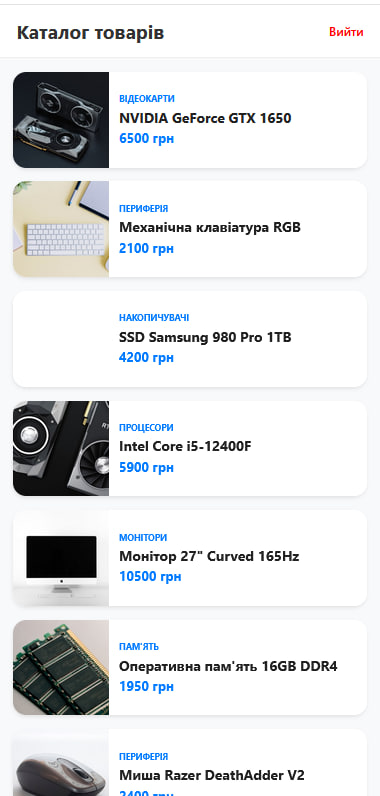
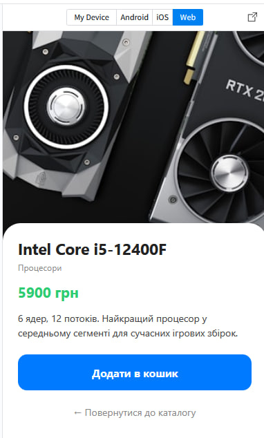

# Лабораторна робота 5 з дисципліни “Розробка мобільних додатків”

## Студент: Хомнюк Віктор (ІПЗ-22-1)

## Опис проєкту
Ця лабораторна робота демонструє створення найпростішого мобільного додатку за допомогою **React Native та Expo**.  
Додаток включає два основні екрани:  

- **Авторизація** – Авторизація користувача  
- **Реєстрація** – Створю аккаунт якщо немає 
- **Каталог** – Каталог всього товару
- **Детальий опис** – Детальний опис всього товару


---

## Скріншоти

- Головна сторінка  
   

- Список завдань  
   

- Каталог 
   
  
- Детальний опис 
   


## Інструкція із запуску

### Попередні кроки
1. Встановити **Node.js** та **npm** (версії сумісні з Expo)  
2. Встановити **Expo CLI** (якщо потрібно):  
   ```bash
   npm install -g expo-cli
   ```
3. Клонувати репозиторій:
   ```bash
   git clone https://github.com/ViktorKhomniuk/MobileLabsRN2026.git
   ``` 
5. Перейти до папки лабораторної роботи:
   ```bash
   cd MobileLabsRN2026/lab1
   ```
6. Встановити залежності:
   ```bash
   npm install
   ```
7. Запустити додаток:
   ```bash
   npx expo start
   ```
=======
# Sample Snack app

Open the `App.js` file to start writing some code. You can preview the changes directly on your phone or tablet by scanning the **QR code** or use the iOS or Android emulators. When you're done, click **Save** and share the link!

When you're ready to see everything that Expo provides (or if you want to use your own editor) you can **Download** your project and use it with [expo cli](https://docs.expo.dev/get-started/installation/#expo-cli)).

All projects created in Snack are publicly available, so you can easily share the link to this project via link, or embed it on a web page with the `<>` button.

If you're having problems, you can tweet to us [@expo](https://twitter.com/expo) or ask in our [forums](https://forums.expo.dev/c/expo-dev-tools/61) or [Discord](https://chat.expo.dev/).

Snack is Open Source. You can find the code on the [GitHub repo](https://github.com/expo/snack).

